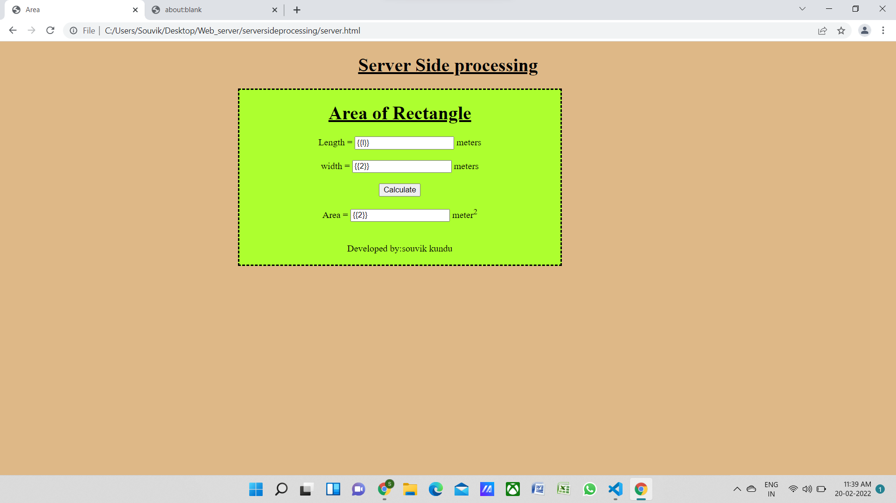

# Design a Website for Server Side Processing

## AIM:
To design a website to perform mathematical calculations in server side.

## DESIGN STEPS:

### Step 1:


### Step 2:


### Step 3:


### Step 4:


### Step 5:


### Step 6:

Publish the website in the given URL.

## PROGRAM :
```
<!DOCTYPE html>
<html>
<head>
    <meta charset='utf-8'>
    <meta http-equiv='X-UA-Compatible' content='IE=edge'>
    <title>Area</title>
    <meta name='viewport' content='width=device-width, initial-scale=1'>
    <style>
        body{
            text-align: center;
            background-color:burlywood;
        }
        .maindiv{
            margin-left:400px;
              text-align: center;
            border-style: dashed;
            width: 550px;
            height: 300px;
            background-color:greenyellow;
        }
        h1{
            text-decoration: underline;
        }
    </style>
</head>
<body>
    <h1>Server Side processing</h1>
    
    <div class="maindiv">
        <h1>Area of Rectangle</h1>
        <form method="POST">
            Length = <input type="text" name="length" value="{{l}}"> meters <br/>
            <br/>
            width = <input type="text" name="width" value="{{2}}"> meters<br/>
            <br/>
            <input type="submit" value="Calculate"><br/>
            <br>
            Area = <input type="text" name="area" value="{{2}}"> meter<sup>2 </sup><br/>
        </form>
        <br>
        <br>
        <footer>
            Developed by:souvik kundu
        </footer>
    </div>
</body>
</html>

```
##views.py
```
from django.shortcuts import render

def areacalculation(request):
    context = {}
    context["area"] = "0"
    context["l"] = "0"
    context["w"] = "0"
    if request.method == "POST":
        b = request.POST.get("length","0")
        h = request.POST.get("width","0")
        area = (int(l) * int(hw)
        context["area"] = area
        context["l"] = l
        context["w"] = w
    return render(request,"mathapp/area.html",context)
  ```
##urls.py
```  
from django.contrib import admin
from django.urls import path
from mathapp import views

urlpatterns = [
    path('admin/', admin.site.urls),
    path("areaofrectangle/",views.areacalculation,name="areaofrectangle"),
    path("",views.areacalculation,name="areaofrectangleroot")
]
```

## OUTPUT:


## Result:
Therefor the above codes are successfully executed to run server side programming and do mathematical calcualtions and it is published in the following url.

